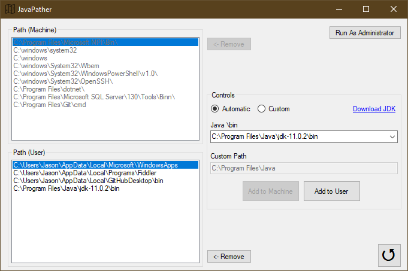

# JavaPather

> Path Manager for Windows - Automatically tries to detect Java and add to Path

## Description

Download: https://github.com/ReignOfComputer/JavaPather/releases

Adding Java to Windows PATH is too many steps, this automatically tries to detect your Java installation and lets you choose to add it to your *User* Environment Variables (*Machine* with Administrator elevation).

  

## But Why?

Adding Java to Windows PATH allows you to use **javac** and **java** commands from CLI, such as Command Prompt and Windows PowerShell. Among other things.

## Usage

1. Launch JavaPather. Program automatically lists Path Variables for Machine and User, and tries to find and list Java installations.
2. Generally, adding to User Path will suffice. Select the Java \bin you want to add (or click Custom for custom directory) and hit Add to User.
3. To manipulate Machine Path, press "Run As Administrator" to elevate.

## License

[MIT License](https://github.com/ReignOfComputer/Stegotreon/blob/master/LICENSE) | &copy; 2019 ReignOfComputer